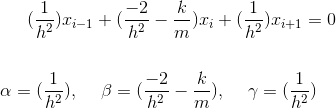

# Spring-Mass-Dynamics
A Simulation of Spring Mass Dynamics

Please be sure to view this with github markdown, or view this online at: https://github.com/piepieninja/Spring-Mass-Dynamics

## About the Simulation
This simulation uses the finite difference and Gauss Seidel methods to compute forward
to arbitrary timesteps

The intial conditions of the sytem are as follows:

initial displacement was `x = 0.7 m` from rest. The mass of the weight was `m = 2.0 kg`.
The restoring force from the initial displacement was `N = 25.6 N`. the spring constant
`k` was calculated with [Hooke's Law](https://en.wikipedia.org/wiki/Hooke%27s_law): giving `k = -1 * (N/x)`

The finite difference method converts the following equation into its discrete form:

This method can be rearranged so that we can move it to an `Ax = b` matrix form:

So that then ...

Now, the `b` matrix is solved for intial conditions and then the [Gauss Seidel](https://en.wikipedia.org/wiki/Gauss%E2%80%93Seidel_method) method is appled with the initial position `x_0 = 0.7` and all others are set to `0.0`. The reason [Gauss Seidel](https://en.wikipedia.org/wiki/Gauss%E2%80%93Seidel_method) works here is because the `A` matrix is diagonally dominant when `h = 0.5`, and when `h` is small in general. 

## Dependencies
* python2.7
* matplotlib
* numpy

## Running

To see the animated simulation, simply run: `python simulation.py`
